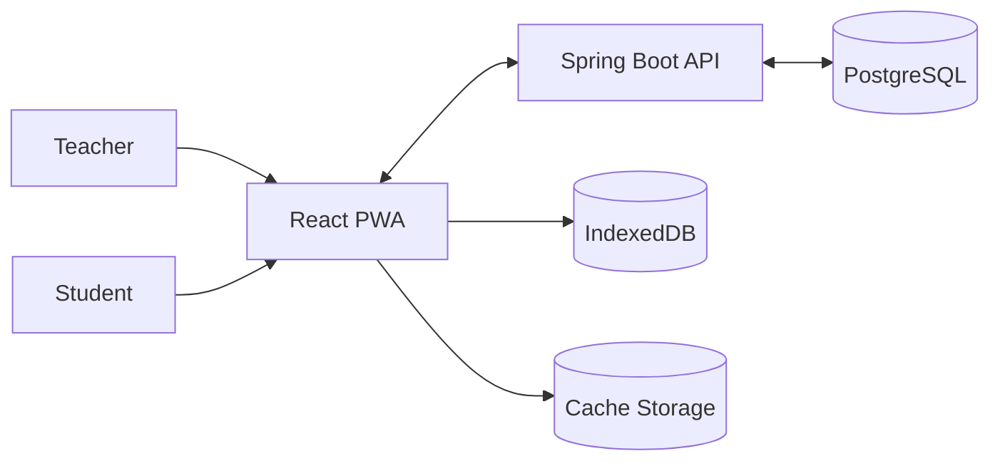
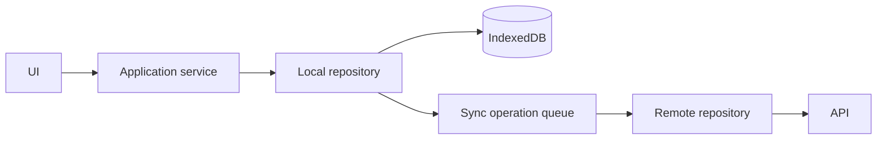
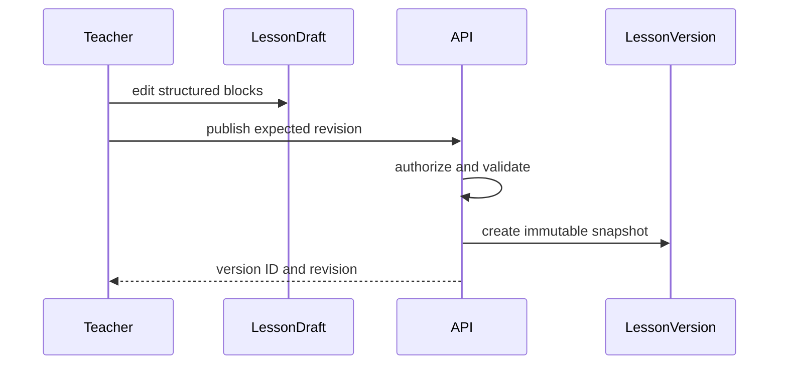

# Architecture

## System context

The browser is the normal interaction surface and local authority for supported offline writes. The backend is the synchronization, authorization, publication, and authoritative assessment layer.

## Containers and layers

The frontend is a static GitHub Pages artifact. Vite centralizes the `/School-Project/` production base and `/` development base. Typed runtime modes select local development, a read-only GitHub Pages demo, or a future remote API. Presentation calls feature application services, which depend on local repository interfaces. IndexedDB adapters persist domain data; the sync engine calls remote REST adapters. Components do not write REST data directly.

The backend is a modular monolith packaged as one Spring Boot application. Feature packages are `identity`, `authorization`, `organization`, `classroom`, `lesson`, `assessment`, `workspace`, `synchronization`, `asset`, `simulationcatalog`, and `events`; `sharedkernel` contains only stable cross-cutting primitives. Features communicate through application contracts or domain events, never another feature's repository.

Phase 1 lesson code separates domain aggregates and typed configurations, transactional application services and ports, JPA entities/adapters, and web DTOs/mappers. The frontend lesson feature separates discriminated models, a static block registry, a repository interface/HTTP adapter, and React views.

## Core flows

Local writes validate and commit atomically with any required sync operation. Failures retain user data and expose state. Operations are idempotent and ordered per entity.

Publishing inserts a new `(lesson_id, version)` row with a complete JSONB block snapshot plus relational title, description, source revision, principal, and publication time. Published rows have no update use case or endpoint. Draft edits update only `lesson_draft`; Hibernate version checks and `If-Match` reject stale writes.

Simulation lifecycle: resolve a statically registered built-in plugin, validate versioned configuration, create or migrate state, reduce actions using deterministic randomness, render through restricted host APIs, serialize snapshots, then dispose resources.

## Dependency rules

- Domain code has no web, JPA, browser, or rendering dependency.
- Application services own use-case authorization checks and transactions.
- Infrastructure implements ports; web DTOs do not expose persistence entities.
- Persisted documents and events include stable IDs, revisions, and independent schema versions.
- Published lesson versions and submitted attempts are immutable.
- JSONB is restricted to typed block configuration and publication snapshots. Identity, ownership, revisions, version numbers, and timestamps remain relational and indexed.

## Trade-offs and deferred decisions

A modular monolith reduces operational complexity while preserving feature boundaries. Local-first writes add explicit synchronization complexity but make offline use reliable. Built-in static plugins trade ecosystem openness for security and deterministic deployment. Analytics pipelines, real-time collaboration, arbitrary plugins, object storage provider, authentication provider, and advanced conflict editors remain deferred.

Phase 1 uses JSON textarea block editors to keep the typed persisted format explicit without adopting a rich editor framework. Formula rendering is safe text, not mathematical typesetting. Simulation, answer, and workspace interactions render typed deferred placeholders.

Decision details live under [docs/ADR](docs/ADR).